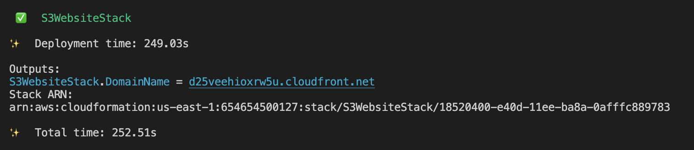

# S3Website

This project was generated with [Angular CLI](https://github.com/angular/angular-cli) version 17.3.0.

## Build

Run `ng build` to build the project. The build artifacts will be stored in the `dist/` directory.

## Development server

Run `npm start` for a dev server. Navigate to `http://localhost:4200/`. The application will automatically reload if you change any of the source files.

## Development server

Run `cdk deploy` to deploy s3 website over S3. You should be able to see cloud formation domain name in output.

